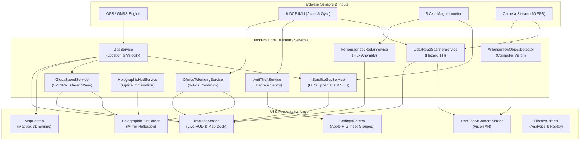
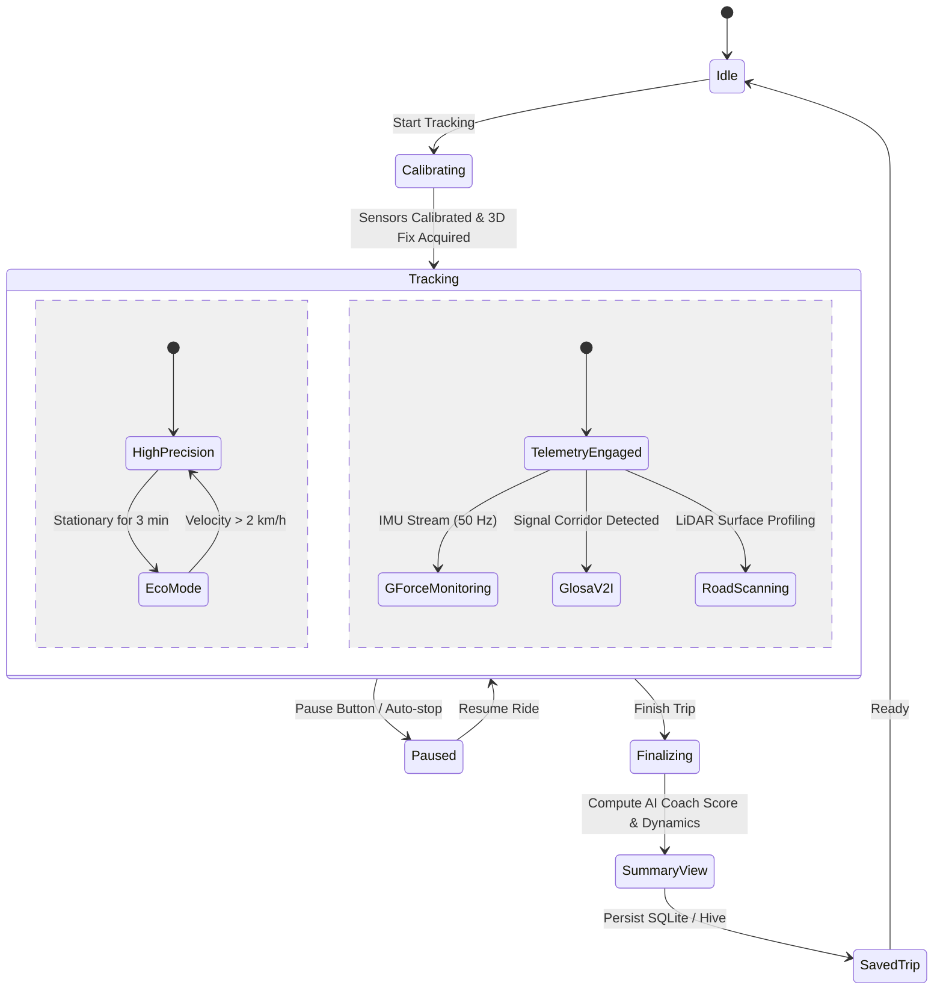
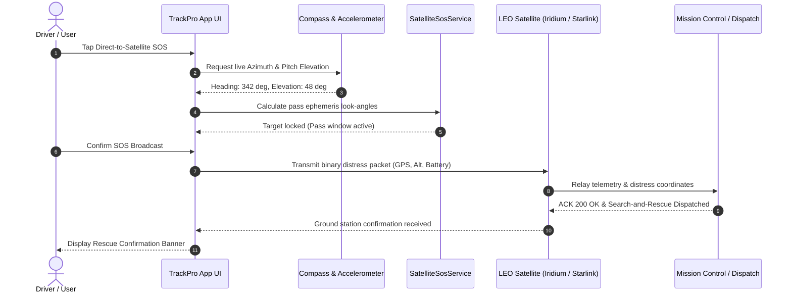
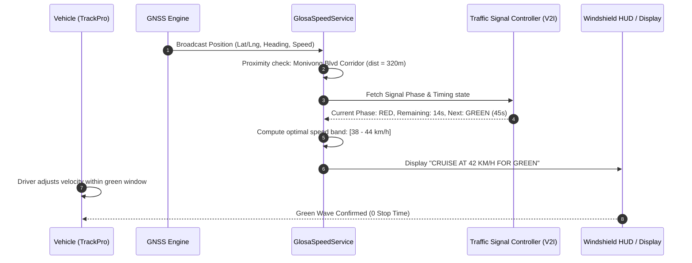
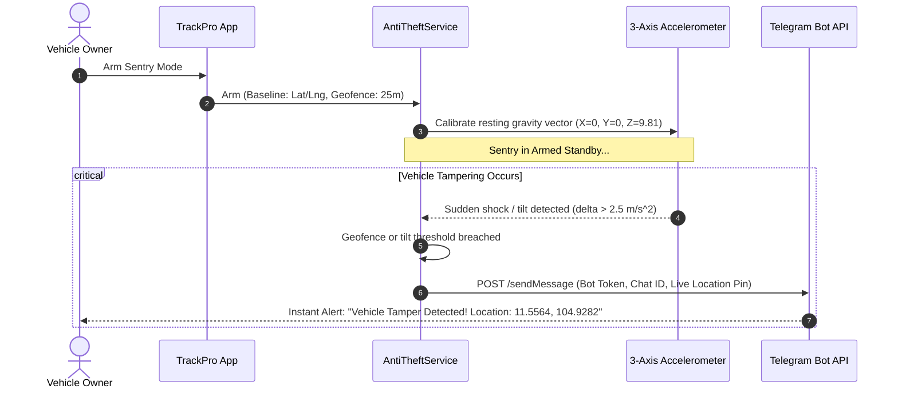
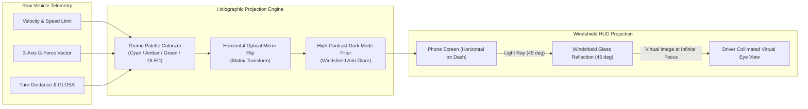

# 🛰️ TrackPro AI — Next-Gen GPS Telemetry & Deep-Tech Navigation

[](https://flutter.dev)
[](https://dart.dev)
[]()
[](https://www.mapbox.com/)
[]()

**TrackPro AI** is an ultra-high performance telemetry, navigation, and vehicle tracking engine built with Flutter. It combines carrier-grade GPS positioning, real-time hardware sensor fusion (accelerometer, gyroscope, 3-axis magnetometer), on-device TensorFlow Lite computer vision, and cutting-edge deep-tech avionics features including Direct-to-Satellite LEO Emergency SOS Pings, GLOSA V2I Traffic Synchronization, Ferromagnetic Geological Radar, and Collimated Holographic Windshield HUD.

---

## 📑 Table of Contents

- [Core Highlights](#-core-highlights)
- [Deep-Tech & Pro Telemetry Suite](#-deep-tech--pro-telemetry-suite)
- [Screens & User Interface](#-screens--user-interface)
- [System Architecture & Visual Workflows](#-system-architecture--visual-workflows)
  - [1. High-Level Sensor Fusion & Telemetry Engine](#1-high-level-sensor-fusion--telemetry-engine)
  - [2. Trip Tracking State Machine](#2-trip-tracking-state-machine)
  - [3. Direct-to-Satellite LEO Emergency SOS Protocol](#3-direct-to-satellite-leo-emergency-sos-protocol)
  - [4. GLOSA V2I Traffic Signal Phase & Timing Flow](#4-glosa-v2i-traffic-signal-phase--timing-flow)
  - [5. AI Anti-Theft Sentry Threat Detection & Dispatch](#5-ai-anti-theft-sentry-threat-detection--dispatch)
  - [6. Collimated Optical HUD Projection Pipeline](#6-collimated-optical-hud-projection-pipeline)
- [Project Directory Structure](#-project-directory-structure)
- [Getting Started](#-getting-started)
- [Configuration & API Setup](#-configuration--api-setup)
- [Building & Deploying](#-building--deploying)
- [Hardware & Platform Support](#-hardware--platform-support)

---

## ⚡ Core Highlights

- **Real-Time Sub-Meter GPS Tracking**: High-accuracy position logging with adaptive frequency throttling, speed, heading, altitude, and distance calculation.
- **Dual Map Engine (Mapbox 3D + FlutterMap Fallback)**: Full vector map rendering with 3D buildings, dynamic terrain extrusion, traffic overlays, and an offline OpenStreetMap fallback layer.
- **AI Driving Coach & Analytics**: Post-trip scoring algorithms evaluating smooth acceleration, braking efficiency, speed consistency, and road condition classification.
- **Vision AR HUD & Object Tracking**: Live AR camera overlay with 3D spatial guidance arrows, lane visualization, and on-device TFLite object detection (vehicles, pedestrians, cyclists).
- **Apple HIG iOS 18 Design Language**: Refined dark OLED aesthetic (`#000000` / `#121214`), smooth inset grouped cards, tactile haptics, and `CupertinoSlidingSegmentedControl` interactions.
- **Trip History & Multi-Format Exporter**: Full trip replay with timeline scrubber, interactive speed charts (`fl_chart`), and one-tap export to **GPX**, **KML**, and **GeoJSON**.

---

## 🔬 Deep-Tech & Pro Telemetry Suite

| Module | Engine / Service | Description |
| :--- | :--- | :--- |
| **🛰️ Direct-to-Satellite LEO SOS** | `SatelliteSosService` | Calculates orbital look-angles for **Iridium NEXT** and **Starlink Direct** constellations using live compass heading & pitch elevation sensors. Dispatches compact emergency distress packets. |
| **🟢 GLOSA Green Wave (V2I)** | `GlosaSpeedService` | **Green Light Optimal Speed Advisory** synchronizes with urban arterial SPaT (Signal Phase & Timing) data corridors to compute optimal speed bands for zero-stop green waves. |
| **🚘 Collimated Holographic HUD** | `HolographicHudService` | Windshield reflection projection mode featuring horizontal mirror-flip, dark-contrast anti-glare rendering, chromatic aberration compensation, and customizable OLED color palettes. |
| **🧲 Ferromagnetic Geological Radar** | `FerromagneticRadarService` | Analyzes 3-axis magnetometer ambient micro-tesla ($\mu T$) flux deviations to detect subterranean metallic voids, pipelines, and structural density anomalies. |
| **📡 LiDAR 3D Road Hazard Scanner** | `LidarRoadScannerService` | 3D spatial depth profiling using camera & motion telemetry to detect road irregularities, potholes, and debris with real-time **Time-To-Impact (TTI)** audible alerts. |
| **🎯 Dynamic 3-Axis G-Force Meter** | `GforceTelemetryService` | High-frequency accelerometer sensor fusion calculating instantaneous lateral, longitudinal, and vertical vector forces with friction-circle tire grip visualization. |
| **🛡️ AI Anti-Theft Sentry** | `AntiTheftService` | Armed accelerometer & gyroscope disturbance triggers with direct **Telegram Bot Webhook** integration for instant push alerts with live GPS location pins. |
| **🔌 OBD-II Live Telemetry** | `Obd2TelemetryService` | Real-time virtual/Bluetooth vehicle CAN-bus integration displaying RPM, coolant temp, throttle position, and diagnostic trouble codes (DTC). |

---

## 📱 Screens & User Interface

### 1. Active Tracking (`TrackingScreen`)
- Real-time speedometer with dynamic color warning bands (Normal, Caution, Overspeed).
- Floating HUD with compass orientation, satellite count, battery level, and altitude.
- Expandable bottom dock with one-touch access to Deep-Tech telemetry sheets and AR mode.
- Interactive custom Location Puck with customizable styles (Arrow, Falcon, Pulsar, Stealth, Cyber).

### 2. Map & Route Exploration (`MapScreen`)
- Fullscreen Mapbox GL with 3D terrain tilt, pitch controls, and dynamic night/day styles.
- Integrated Route Planner with turn-by-turn navigation preview.
- Trip replay mode with speed multiplier ($1\times, 2\times, 4\times, 8\times$) and progress scrubber.

### 3. AR Camera Guidance (`TrackingArCameraScreen`)
- Full-screen real-time camera feed overlay with heads-up guidance.
- TensorFlow Lite object detection bounding boxes with distance estimation.
- 3D horizon reticle and route guidance arrows anchored to device orientation.

### 4. Trip Analytics & History (`HistoryScreen` & `SummaryScreen`)
- Searchable list of past trips with interactive thumbnails and route previews.
- Deep trip analysis: max speed, avg speed, elevation gain/loss, total duration, idle time.
- Speed and elevation timeline graph with touch-to-inspect tooltips.
- Instant GPX / KML / GeoJSON export and system share sheet.

### 5. Apple HIG Settings & Sentry (`SettingsScreen`)
- **System Telemetry Hero Card**: Live GPS permission monitor, precision mode, and queue status.
- **Unit Configuration**: Instant switching between Metric (`KM/H`) and Imperial (`MPH`).
- **Precision Modes**: `NAV (1m)`, `HIGH (4m)`, and `ECO (10m)` battery optimization.
- **Telegram Sentry Webhook**: Configure Bot Token & Chat ID with live ping verification.
- **HUD Theme Picker**: Select Cyberpunk Cyan, Racing Amber, Stealth Green, or OLED White.

---

## 🏗️ System Architecture & Visual Workflows

### 1. High-Level Sensor Fusion & Telemetry Engine

The core telemetry pipeline connects real-time smartphone hardware sensors (GNSS, 6-DOF IMU, 3-Axis Magnetometer, and 60 FPS Camera Stream) to specialized deep-tech processing engines before projecting onto the presentation layer.



---

### 2. Trip Tracking State Machine

The active tracking session dynamically manages power modes, background GPS sampling rates, and concurrent telemetry streams based on motion dynamics.



---

### 3. Direct-to-Satellite LEO Emergency SOS Protocol

When cellular coverage fails, the satellite radar targets LEO passes (Iridium NEXT / Starlink Direct) via onboard sensor alignment before dispatching distress payloads.



---

### 4. GLOSA V2I Traffic Signal Phase & Timing Flow

The Green Light Optimal Speed Advisory (GLOSA) system syncs with arterial intersection SPaT (Signal Phase & Timing) broadcasts to ensure seamless non-stop transit.



---

### 5. AI Anti-Theft Sentry Threat Detection & Dispatch

Armed sentry mode establishes a static 3-axis gravity vector baseline. If unexpected physical vibration, tilt, or geofence deviation occurs, an instant alert is pushed to Telegram.



---

### 6. Collimated Optical HUD Projection Pipeline

The Holographic HUD system flips and dark-filters vehicle telemetry so that when placed horizontally on a vehicle dashboard, it reflects sharply into the driver's forward eye line without ghosting.



---

## 📂 Project Directory Structure

```text
lib/
├── main.dart                                # Application entry point & service initialization
├── models/
│   ├── ar_guidance_models.dart              # AR direction & marker coordinate models
│   ├── location_puck_style.dart             # Puck styling & visual indicator definitions
│   ├── mapbox_3d_config.dart                # 3D building & terrain configuration
│   ├── saved_trip.dart                      # Local persisted trip entity
│   ├── tracking_accuracy_mode.dart          # Accuracy & frequency throttling profiles
│   └── trip_data.dart                       # Live GPS coordinate & breadcrumb point model
├── navigation/
│   └── app_routes.dart                      # Route paths & navigation helpers
├── screens/
│   ├── diagnostics/                         # Hardware & sensor diagnostics
│   ├── export/                              # GPX, KML, GeoJSON export screen
│   ├── history/                             # Trip history list, detail view, & charts
│   ├── map/                                 # Mapbox 3D map, controls, & replay panel
│   ├── onboarding/                          # First-time permissions onboarding
│   ├── settings_screen.dart                 # iOS 18 Apple HIG Settings UI
│   ├── summary/                             # Post-ride summary & AI coach score
│   └── tracking/                            # Main active tracking screen & AR camera
├── services/
│   ├── ai_object_tracking_service.dart      # Bounding box smoothing & tracking
│   ├── ai_tensorflow_object_detector*.dart  # TFLite object detection (mobile & stub)
│   ├── anti_theft_service.dart              # Motion disturbance detection & Telegram alert
│   ├── ferromagnetic_radar_service.dart     # Magnetometer geological & metallic anomaly scanner
│   ├── gforce_telemetry_service.dart        # 3-axis vector acceleration & friction-circle
│   ├── glosa_speed_service.dart             # Green Light Optimal Speed Advisory (V2I)
│   ├── gps_service.dart                     # Real-time GNSS location stream & metrics
│   ├── holographic_hud_service.dart         # Windshield HUD projection & color profiles
│   ├── lidar_road_scanner_service.dart      # Virtual LiDAR road hazard & TTI detection
│   ├── mapbox_3d_service.dart               # Mapbox vector tile & 3D styling coordinator
│   ├── offline_sync_queue.dart              # Offline SQLite/local storage sync engine
│   ├── satellite_sos_service.dart           # LEO satellite alignment radar & emergency ping
│   ├── settings_service.dart                # Preferences manager (SharedPreferences)
│   └── trip_export_service.dart             # GPX / KML / GeoJSON document generator
├── theme/
│   └── app_theme.dart                       # Global OLED dark theme & typography
├── utils/
│   ├── app_haptics.dart                     # Tactile vibration feedback manager
│   ├── app_logger.dart                      # Structured logging utility
│   └── smooth_polyline.dart                 # Bezier curve route polyline smoothing
└── widgets/
    ├── common/                              # Reusable Apple HIG styled cards, pills, buttons
    ├── settings/                            # Location puck style selector
    └── telemetry/                           # Deep-tech sheets & HUD screens
```

---

## 🚀 Getting Started

### Prerequisites

- **Flutter SDK**: `>= 3.24.0`
- **Dart SDK**: `>= 3.0.0 < 4.0.0`
- **Xcode** (for iOS deployment): `>= 15.0` with CocoaPods
- **Android Studio** (for Android deployment): NDK enabled
- **Mapbox Access Token**: Required for Mapbox vector 3D maps

### Installation

1. **Clone the repository:**
   ```bash
   git clone https://github.com/Heng-zm/gps.git
   cd gps
   ```

2. **Install Flutter dependencies:**
   ```bash
   flutter pub get
   ```

3. **Verify analyzer integrity:**
   ```bash
   flutter analyze
   ```

4. **Launch the application:**
   ```bash
   # Run on connected iOS device
   flutter run -d ios

   # Run on connected Android device
   flutter run -d android

   # Run on Chrome (Web)
   flutter run -d chrome
   ```

---

## ⚙️ Configuration & API Setup

### 1. Mapbox Configuration
To enable high-definition 3D terrain and vector maps:
- Create an account at [Mapbox](https://account.mapbox.com/).
- In iOS: Set `MBXAccessToken` in `ios/Runner/Info.plist`.
- In Android: Add your public download token in `android/app/src/main/res/values/strings.xml`.

*(If no token is supplied, the app automatically falls back gracefully to the OpenStreetMap raster layer).*

### 2. Telegram Anti-Theft Sentry Setup
To receive instant break-in and unauthorized motion alerts:
1. Message `@BotFather` on Telegram to create a bot and get an **API Bot Token**.
2. Start a chat with your bot and send any message.
3. Obtain your **Chat ID** (e.g., using `@userinfobot`).
4. In the app: Navigate to **Settings > Security & Anti-Theft Sentry**, tap **Configure Telegram Bot**, enter your credentials, and tap **Send Test Alert**.

### 3. TensorFlow Lite Computer Vision Models
Object detection models are placed under `assets/models/`:
- `coco_ssd_mobilenet.tflite` — Quantized MobileNet object detection model.
- `coco_labels.txt` — Class label map (person, bicycle, car, motorcycle, bus, truck, etc.).

---

## 🛠️ Building & Deploying

### iOS Release Build
```bash
flutter build ipa --release
```
> [!NOTE]
> Ensure all camera, motion, and background location permission usage descriptions are defined in `ios/Runner/Info.plist` (`NSLocationAlwaysAndWhenInUseUsageDescription`, `NSMotionUsageDescription`, `NSCameraUsageDescription`).

### Android Release APK / Bundle
```bash
flutter build appbundle --release
# or APK:
flutter build apk --release
```

### Flutter Web Build
```bash
flutter build web --release --web-renderer canvaskit
```

---

## 📡 Hardware & Platform Support

| Feature | iOS | Android | Web | Requirements |
| :--- | :---: | :---: | :---: | :--- |
| **GPS / GNSS Tracking** | ✅ | ✅ | ⚠️ | Location Services enabled (Web accuracy depends on browser API) |
| **Mapbox 3D Terrain** | ✅ | ✅ | ⚠️ | Fallback to OpenStreetMap on Web |
| **3-Axis G-Force / IMU** | ✅ | ✅ | ❌ | Hardware Accelerometer & Gyroscope |
| **LEO Satellite Compass**| ✅ | ✅ | ❌ | Hardware Digital Compass / Magnetometer |
| **Ferromagnetic Radar** | ✅ | ✅ | ❌ | 3-Axis Magnetometer sensor |
| **Vision AR Camera HUD** | ✅ | ✅ | ❌ | Rear-facing Camera & TFLite delegate |
| **Telegram Sentry Alerts**| ✅ | ✅ | ✅ | Network connectivity (HTTPS) |
| **Holographic HUD** | ✅ | ✅ | ✅ | Any OLED/LCD display positioned on dashboard |

---

## 📄 License

Copyright © 2026 Heng-zm. All rights reserved. Proprietary software.
